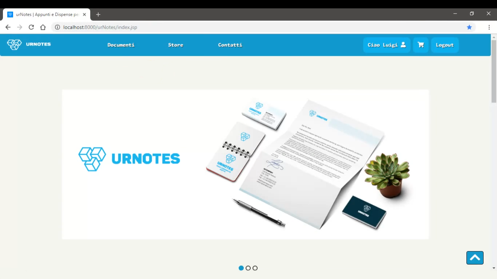

# Descrizione

urNotes è una piattaforma che opera nell’istruzione, in particolare nel campo Universitario.
La Scelta del nome, “urNotes” serve a delineare il concetto di relazione tra lo studente e gli appunti, dove lo scopo non è solo quello di fornire materiale didattico allo studente per supportarlo nel percorso universitario, ma anche di dare la possibilità di condividere i propri appunti con altri studenti.
La Piattaforma prevede la presenza di un Utente ospite, ovvero non registrato, in cui ha la possibilità solamente di ricercare un appunto e visualizzarne la pagina descrittiva, mentre per svolgere operazioni come l’aggiunta di un appunto al carrello e acquistarlo, bisogna essere registrato.
Lo Studente, effettuata la registrazione, accederà al sito e avrà accesso al proprio profilo personale (Ordini Effettuati, Nome, Cognome, Indirizzo Consegne ecc.), potrà quindi inviare una richiesta di pubblicazione appunto al gestore, visualizzare il catalogo degli appunti, ordinato alfabeticamente per materia di interesse, visualizzare un appunto e aggiungerlo al carrello per poi procedere con il pagamento.
Analogamente il gestore, potrà accedere alla piattaforma, visualizzare l’elenco degli appunti presenti e le richieste di pubblicazione appunti inviate dagli studenti, ma anche modificare o eliminare appunti e recensioni.

# Obiettivi

Il Sistema proposto ha l’obiettivo di fungere da strumento di supporto allo studente e soprattutto di assicurare un’interazione semplice ed efficiente tra studente e gestore. 
La Piattaforma urNotes punta ad essere un sistema intuitivo, semplice e immediato che permetta allo studente di avere una visione completa di ciò che davvero ha bisogno nello studio, e al gestore di interagire in modo efficace con lo studente. 
L’Obiettivo principale di urNotes è quello di fornire allo studente materiale didattico, ordinato per materia d’interesse, e di supportarlo durante il percorso universitario.
La Piattaforma realizzata non presenta delle funzionalità nuove, ma lo scopo è di facilitare lo studente nell’apprensione degli argomenti interessati grazie alla presenza di materiale concreto e accurato.

Per realizzare ciò, la piattaforma presenta vari aspetti, tra cui:
•	Offrire la possibilità di visualizzare un elenco di appunti per materia

•	Offrire uno strumento che consente di inviare e richiedere la pubblicazione di un appunto

•	Offrire un’interfaccia semplice ed efficace 

•	Offrire uno strumento che consente di accettare o rifiutare la pubblicazione di un appunto
